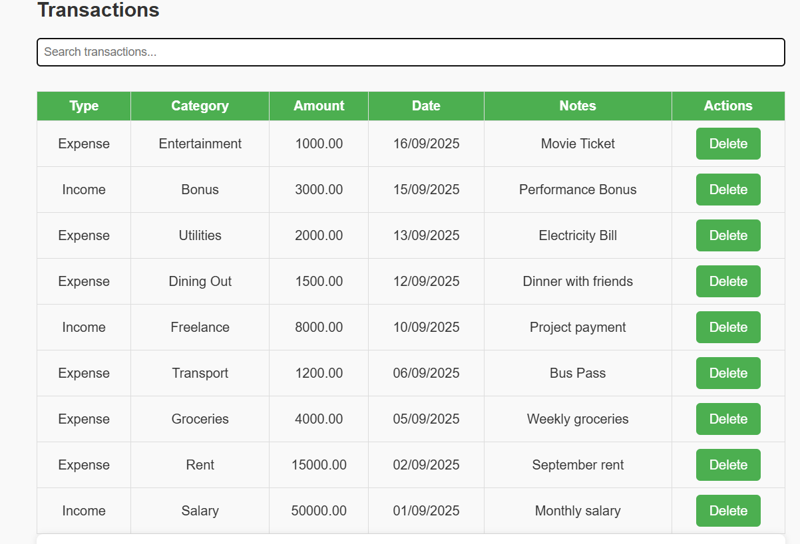

# Personal Budget Tracker

A platform to manage personal finances by tracking income, expenses, and group expenses with settlements.

## Features

- Add, edit, and delete income and expense transactions
- Categorize transactions by type and category
- View a dashboard with total income, expenses, and balance
- Visualize income and expenses with charts
- Manage groups for shared expenses
- Add expenses and settlements within groups
- API backend built with Node.js, Express, and MongoDB

## Technology Stack

- Frontend: JavaScript, HTML, CSS
- Backend: Node.js, Express.js, MongoDB, Mongoose
- Database: MongoDB 

## Project Structure

/IIT-G Project
│
├── backend
│ ├── index.js # Express server, API routes, Mongoose models
│ └── package.json # Backend dependencies and scripts
│
├── frontend
│ ├── frontend.html # Main HTML file
│ ├── app.js # Frontend JavaScript for UI and API calls
│
├── images # Screenshots and UI images
│ ├── PBT-Dashboard.png
│ ├── PBT-DataSummary.png
│ ├── PBT-GrpExp.png
│ ├── PBT-GrpMang.png
│ ├── PBT-GrpSett.png
│ ├── PBT-Overview.png
│ └── PBT-Transaction.png
│
└── README.md # Project documentation

## Images / Screenshots

### Dashboard

### Data Summary

### Group Expenses

### Group Management

### Group Settlements

### Overview

### Add Transaction

## Installation and Setup

1. **Clone the repository:**
git clone https://github.com/Harshita4805/Personal-Budget-Tracker.git
cd Personal-Budget-Tracker

2. **Backend setup:**
cd backend
npm install

3. **Make sure MongoDB is running locally or update the MongoDB URI in `index.js`:**
const mongoURI = 'mongodb://127.0.0.1:27017/personal-budget-tracker';

4. **Start the backend server:**
node index.js

5. **Frontend setup:**
Open `frontend/frontend.html` directly in your browser or serve it using a live server extension.

## Usage

- Use the "Add Transaction" form to enter income or expenses.
- View transaction details and dashboard summaries on the homepage.
- Create and manage groups for shared expenses.
- Add group expenses and settlements through group interfaces (if implemented in frontend).

## API Endpoints

- **Transactions:**
- `GET /api/transactions` - Get all transactions
- `POST /api/transactions` - Add a new transaction
- `DELETE /api/transactions/:id` - Delete a transaction

- **Groups:**
- `GET /api/groups` - Get all groups
- `POST /api/groups` - Create a group
- `GET /api/groups/:id` - Get a specific group
- `POST /api/groups/:id/expenses` - Add an expense to a group
- `POST /api/groups/:id/settlements` - Add a settlement record to a group

## License

This project is licensed under the MIT License.

